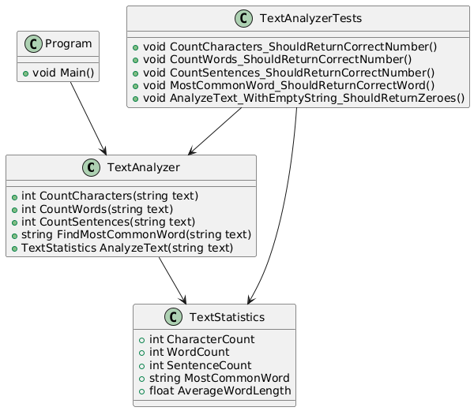

### **Zadanie: Aplikacja do analizy tekstu z testami jednostkowymi (NUnit)**  

## **Cel zadania**  
Celem tego zadania jest stworzenie aplikacji w języku C# wykorzystującej platformę .NET, która będzie pobierać tekst od użytkownika (z klawiatury lub z pliku) i obliczać różne statystyki dotyczące wpisanego tekstu.  
Dodatkowo studenci powinni napisać testy jednostkowe przy użyciu **frameworka NUnit** w celu zweryfikowania poprawności działania aplikacji.  

## **Wymagania funkcjonalne**  
1. **Pobieranie danych wejściowych**  
   - Aplikacja powinna umożliwiać użytkownikowi wybór źródła danych:  
     a) Wprowadzenie tekstu ręcznie w konsoli.  
     b) Wczytanie tekstu z pliku (ścieżka do pliku podana przez użytkownika).  
     c) Podanie lokalizacji pliku jako argument wiersza polecień

2. **Obliczanie statystyk**  
   - Aplikacja powinna obliczać następujące statystyki dla podanego tekstu:  
     - **Liczba znaków (ze spacjami)**.  
     - **Liczba znaków (bez spacji)**.  
     - **Liczba liter w tekście** (ignorując cyfry, znaki specjalne i interpunkcyjne).  
     - **Liczba cyfr w tekście**.  
     - **Liczba znaków interpunkcyjnych**.  
     - **Liczba słów**.  
     - **Liczba unikalnych słów**.  
     - **Najczęściej występujące słowo**.  
     - **Średnia długość słowa**.  
     - **Najdłuższe i najkrótsze słowo w tekście**.  
     - **Liczba zdań** (przyjmując, że zdania kończą się znakami: `.` `!` `?`).  
     - **Średnia liczba słów na zdanie**.  
     - **Najdłuższe zdanie pod względem liczby słów**.  

3. **Testy jednostkowe (NUnit)**  
   - Aplikacja powinna zawierać testy jednostkowe weryfikujące poprawność implementacji funkcji analizy tekstu.  
   - Testy muszą być napisane **w NUnit**.  
   - Przykładowe przypadki testowe:  
     - Sprawdzenie poprawności liczenia znaków.  
     - Weryfikacja liczby słów w różnych przypadkach.  
     - Sprawdzenie poprawności detekcji najczęściej występującego słowa.  
     - Testy dla pustego tekstu i tekstu zawierającego tylko białe znaki.  
     - Testy dla krótkich i długich tekstów o różnej strukturze.  

4. **Wyświetlanie wyników**  
   - Wyniki powinny być czytelnie wyświetlane w konsoli.  

5. **Obsługa błędów**  
   - Aplikacja powinna obsługiwać błędy związane z:  
     - Nieprawidłową ścieżką do pliku.  
     - Pustym plikiem lub pustym wejściem użytkownika.  

## **Przykładowe testy jednostkowe w NUnit**  

#### **Testy dla klasy `TextAnalyzer`**
```csharp
using NUnit.Framework;
using System.Collections.Generic;

[TestFixture]
public class TextAnalyzerTests
{
    [Test]
    public void CountCharacters_ShouldReturnCorrectNumber()
    {
        var text = "Hello, world!";
        int result = TextAnalyzer.CountCharacters(text);
        Assert.AreEqual(13, result);
    }

    [Test]
    public void CountWords_ShouldReturnCorrectNumber()
    {
        var text = "Hello world!";
        int result = TextAnalyzer.CountWords(text);
        Assert.AreEqual(2, result);
    }

    [Test]
    public void CountSentences_ShouldReturnCorrectNumber()
    {
        var text = "Hello world! How are you? I am fine.";
        int result = TextAnalyzer.CountSentences(text);
        Assert.AreEqual(3, result);
    }

    [Test]
    public void MostCommonWord_ShouldReturnCorrectWord()
    {
        var text = "apple banana apple orange apple banana";
        string result = TextAnalyzer.FindMostCommonWord(text);
        Assert.AreEqual("apple", result);
    }

    [Test]
    public void AnalyzeText_WithEmptyString_ShouldReturnZeroes()
    {
        var text = "";
        var result = TextAnalyzer.AnalyzeText(text);
        
        Assert.AreEqual(0, result.CharacterCount);
        Assert.AreEqual(0, result.WordCount);
        Assert.AreEqual(0, result.SentenceCount);
    }
}
```

## **Instrukcje dotyczące testowania w NUnit**  
1. **Dodanie NUnit do projektu**  
   - Utwórz osobny projekt testowy w Visual Studio (**NUnit Test Project**).  
   - W **NuGet Package Manager** zainstaluj:  
     - `NUnit`  
     - `NUnit3TestAdapter` (dla integracji z Test Explorer w Visual Studio).  
   - Dodaj referencję do głównego projektu aplikacji.  

2. **Struktura projektu**
   ```
   /TextAnalyzer
     ├── Program.cs
     ├── TextAnalyzer.cs
     ├── TextStatistics.cs
   /TextAnalyzer.Tests
     ├── TextAnalyzerTests.cs
   ```

3. **Uruchamianie testów**  
   - Otwórz **Test Explorer** w Visual Studio (`Test > Test Explorer`).  
   - Uruchom testy (`Run All`).  


---
